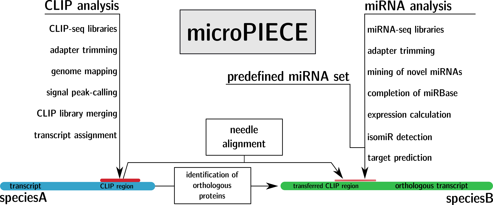

# Summary
All microRNAs are assumed to be post-transcriptional fine-regulators. With a length of around 21 nucleotides, they form a RNA-induced silencing complex (RISC) complex with a protein of the Argonaute family. This complex then binds to the messengerRNA untranslated regions and coding sequence regions and in general promotes degradation or translational inhibition. It is now important to know the microRNA-mRNA pairs in order to infer dysregulating effects on the organism. In order to assign a microRNA to a mRNA target, various tools with different technical approaches were developed. They are mostly based on the assumption that the first eight nucleotides of the microRNA (seed region) determine the binding region on the mRNA. Some approaches also include supporting bindings in the rear part of the microRNA, others take secondary structures of the mRNA or binding energies of the mRNA-miRNA complex into account. Nevertheless, they all suffer from the statistical problem that such short target regions, often occur simply by chance in transcript sequences. This results in a huge amount of false positive predictions. A target prediction of all 430 *Tribolium castaneum* mature microRNAs from [miRBase.org](http://mirbase.org/) against all 18.534 protein coding cDNA sequences from [Ensembl.org](http://www.ensembl.org/index.html) results in 2.203.593 possible microRNA-target interactions, predicted by the commonly used tool `miranda` [@betel2008microrna] with standard parameters. To increase the credibility, wet lab validation methods like luciferase reporter assays are required. The disadvantage here is that this workflow is not applicable for high-throughput analysis, as it can only treat small subsets of sequence combinations. Another, more scalable method is cross-linking immunoprecipitation-high-throughput sequencing (CLIP-seq). Here, binding regions of the RISC show a specific signal in the sequencing reads that can be used to shrink the search space of miRNA target predictions, when mapping them to the transcriptome. The limitation here is the difficult technical treatment in the laboratory. This is the reason why there are only a few datasets available for human, mouse, worm and mosquito. It would now be useful, if we could simply transfer the information of a binding region, already identified by CLIP-seq, to another species. This is what our `microPIECE` (**micro**RNA **pi**peline **e**nhanced by **C**LIP **e**xperiments) is about. 

The pipeline takes the AGO-CLIP data from a *speciesA* and transfers it to a *speciesB*. Given a set of miRNAs from *speciesB* it then predicts their targets on the transfered CLIP regions. 

For the *minimal workflow*, it needs a genome file, as well as its annotation file in `GFF` format. For *speciesA* at least one AGO-CLIP dataset is needed and *speciesB* needs a set of miRNAs for the target prediction. 
For the *full workflow*, a set of smallRNA-sequencing data is additionally needed and a set of non-coding RNAs can be provided as filter. The pipeline uses the smallRNA data for the mining of novel microRNAs and the completion of the given miRNA dataset, if needed. It further performs expression calculation, isoform detection, genomic loci identification and orthology determination. 

In case of a provided smallRNA dataset, the pipeline (Figure 1) starts with the miRNA analysis. It uses `Cutadapt` [@martin2011cutadapt] to trim the adapter sequences from the small RNA sequencing libraries from *speciesB*. If provided, the trimmed libraries are filtered for ncRNAs using `bwa` [@li2009fast].The resulting files are merged into a pooled set and used for mining of novel microRNAs with `miRDeep2` [@friedlander2011mirdeep2]. The pipeline then parses the result file and tries to add missing entries from the [miRBase.org](http://mirbase.org/) database [@kozomara2013mirbase], e.g. if only one arm was previously annotated and the mining discoveres the exact position of the particular arm. The novel miRNAs and completed entries are merged to the existing miRNA set and used as reference for the following analysis. The expression of each miRNA is calculated as `ReadsPerMillion`, outgoing from the non-pooled trimmed and filtered libraries. The pipeline also accounts for miRNA isoforms, by removing all trimmed reads, containing undetermined nucleotides. Orthologous miRNAs in other species were determined by a `BLASTN` [@altschul1990basic] search against all metazoan miRNAs from [miRBase.org](http://mirbase.org/). Finally, the genomic regions for the miRNAs were also identified by a `BLASTN` search against the genome of *speciesB*.

If no smallRNA dataset is provided, the pipeline directly jumps to the CLIP analysis. There it starts with the *speciesA* CLIP-seq library trimming, using `Cutadapt` [@martin2011cutadapt]. Trimmed reads are then mapped to the genome with `gsnap` [@wu2005gmap] and the results are evaluated by `Piranha` [@uren2012site]. Then the libraries are merged into the `BED` file format. We further used `SAMtools` [@li2009sequence] and `BEDtools` [@quinlan2010bedtools] for file conversions during the pipeline. The `BED` file includes a column that displays how many libraries support each genomic position. Next, a file for each library-support-level is created, so that the user can in the end decide how many CLIP libraries are necessary to account this region as binding region. Now for each library-support-level, an assignment of each sequence to the transcriptome is performed. Outgoing from the transcript, the corresponding protein is used to discover the orthologous protein in the *speciesB* by `Proteinortho` [@lechner2011proteinortho]. This information is used as criteria to align the CLIP region from *speciesA* to the orthologous transcript in *speciesB* with `EMBOSS Needle` [@rice2000emboss].

Finally, the pipeline passes the miRNA set (either from the *full* or *minimal workflow*) to `miraligner` from the `seqbuster` package [@pantano2009seqbuster]. We then perform a target prediction with `miranda` [@betel2008microrna] on the previously transfered orthologous CLIP regions. 

Depending on the provided data, the minimal output of the pipeline consists of a target prediction output from `miranda` for each library-support-level, based on the transfered CLIP regions. In case the pipeline additionally received smallRNA data, a microRNA set with known and novel miRNAs together with an expression file is saved, as well as the orthologs to other species, the genomic loci of the miRNAs and the identified isoforms.

# References
